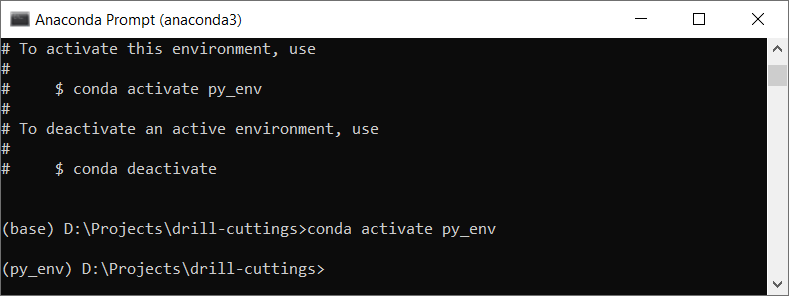
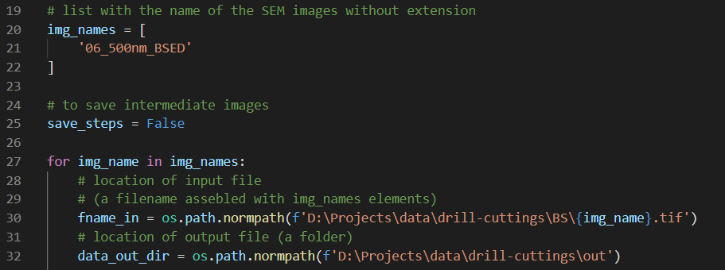
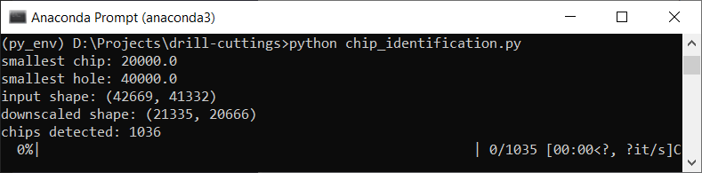

# Drill cuttings thin section chip segmentation

A collection of Python scripts to isolate and segment individual drill cuttings chips in thin section scanning electron microscope (SEM) images. 

# Getting started
Clone this repository to yur local machine using your tool of choice. Install [Anaconda](https://www.anaconda.com/) if you don't have it and open the [Anaconda Prompt](https://docs.anaconda.com/anaconda/user-guide/getting-started/). **Navigate to the location of the cloned repository** and install the [environment](environment.yml) using the command:  
`conda env create -f environment.yml`

Installing the `environment.yml` might take some time. 
Then, follow the instructions to activate the newly installed environment:  
`conda activate py_env`

The terminal should look something like this:  

Now you should be able to segment the individual drill cuttings using the [chip_identification](./chip_identification.py) script - remember to use the `py_env` environment.

# Isolating and segmenting chips
Open your local [chip_identification](./chip_identification.py) and modify the input and output parameters. 

The program expects `img_names` as a list containing one or more image names without the extension. Inside the loop, the variable `fname_in` uses the elements in `img_names` to assemble the full file name. The variable `data_out_dir` indicates where the output data will be saved. Other parameters that can be used for tuning include: 
- `downscale_factor`: to reduce the size of the original image;
- `min_intensity`: pixels with values smaller than `min_intensity` are considered background;  
- `max_intensity`: pixels with values larger than `max_intensity` are considered as part of a chip;
- `scale_nm_per_pixel`: identifies the size of the pixels;
- `min_hole` and `min_chip`: the smallest hole and smallest chip thresholds for topological operations. 

Moreover, `save_steps` can be set to `True` so the program saves all steps of the segmentation, including the before and after for topological operations. 

After setting the parameters, the program can be executed calling:  
`python chip_identification.py`

The isolated and segmented chips are saved in the output folder specified in `data_out_dir`

*******************************************************************************************************************
_Software here is distributed on an "AS IS" BASIS, WITHOUT WARRANTIES OR CONDITIONS OF ANY KIND, either express or implied._
